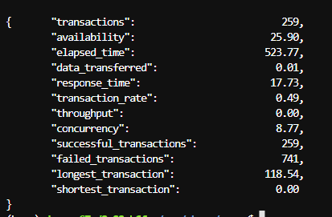

# Progjar-ETS

- Arkana Bilal Imani
- 5025211034
- Pemrograman Jaringan E

Berisi kode python yang berfungsi untuk menjalankan server dengan metode multiprocessing dan multithreading. Ada variasi secure juga yang menggunakan ssl.

# Screenshots

## Multithreading non secure

## Multithreading secure

## Multiprocess non secure

## Multiprocess secure

